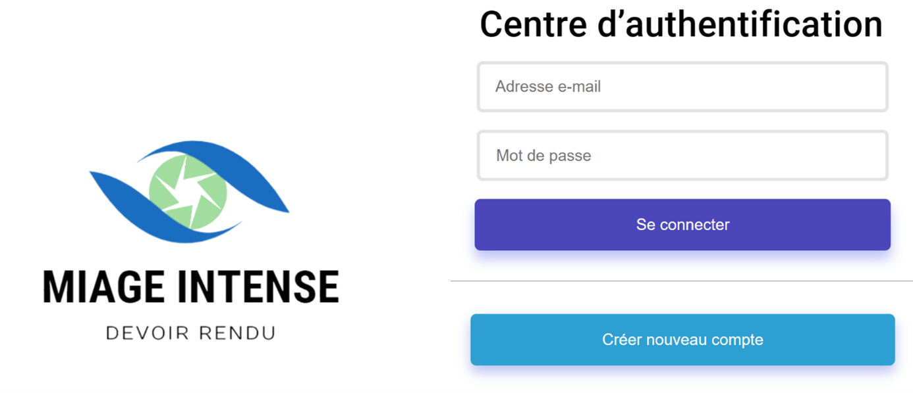

# Assignment_Camara_et_Tine
Projet angular sur les assignments
 ## Page d'authentification
 Notre page d'authentification est la suivante:
 

 ## Démarrage du projet
 Avant tout, il faut faire "npm install" au niveau de l'api et du client
 ## Lancement du serveur
 Pour ce fait, on ouvre un terminal on se place dans le dossier api en faisant cd api
 et ensuite on tape la commande "node server.js"
 ## Lancement du client
 On ouvre un deuxième terminal en parallèle, on se place dans le dossier principal en
 faisant cd front/src/app et ensuite on tape la commande "ng serve"
 ## Hebergement
 Nous utilisons render.com, avec les étapes suivantes:
 étapes pour héberger un site web sur Render.com :
 - Créer un compte sur Render.com.
 - Créer un nouveau déploiement en choisissant un type de projet.
 - Configurer les paramètres de déploiement, tels que les variables d’environnement et les ports exposés.
 - Connecter notre référentiel de code (GitHub) pour automatiser les déploiements à chaque fois que du nouveau code est poussé.
 - Déclencher un déploiement manuellement ou attendre que le déploiement automatique soit effectué.
 - Accéder à notre site web en utilisant l’URL fournie par Render.com.
 - Utiliser les outils de surveillance et de débogage de Render pour surveiller les performances de notre site et résoudre les problèmes éventuels.
 ### URL de notre site
 Le lien est: 
